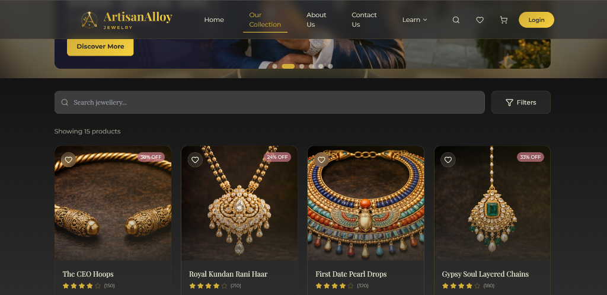
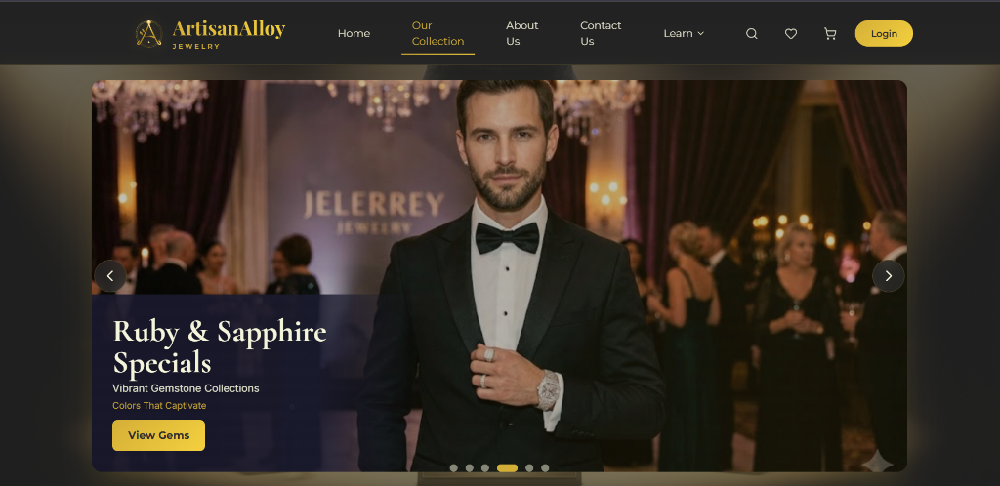
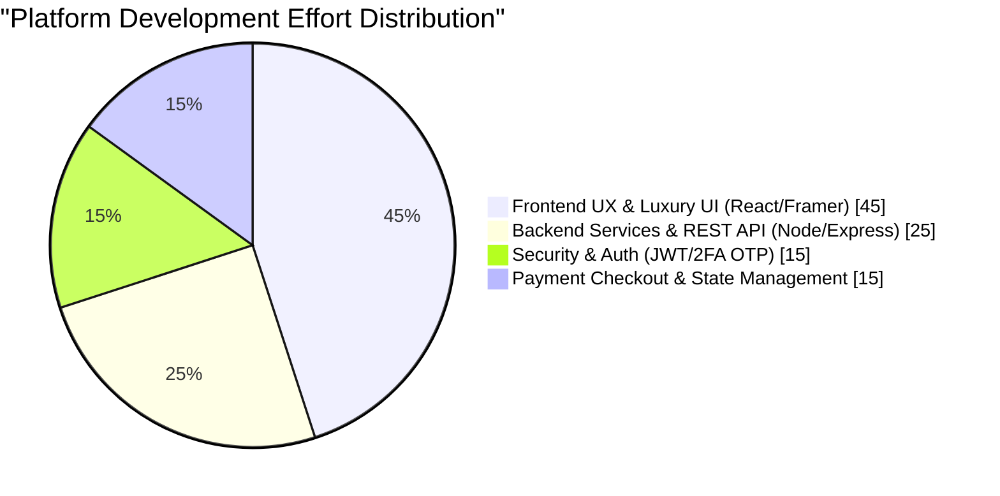
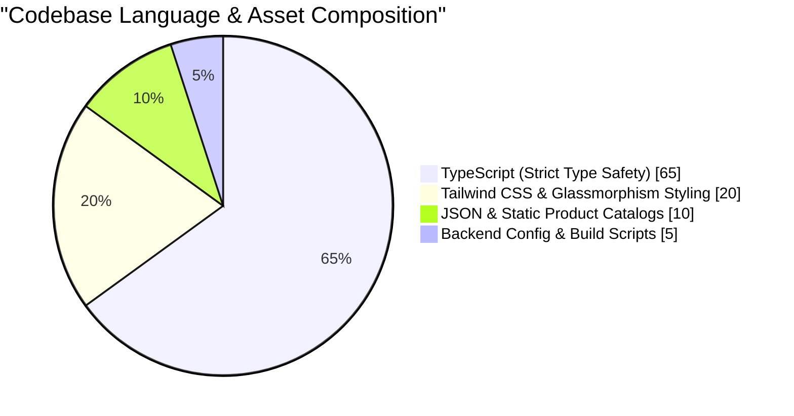
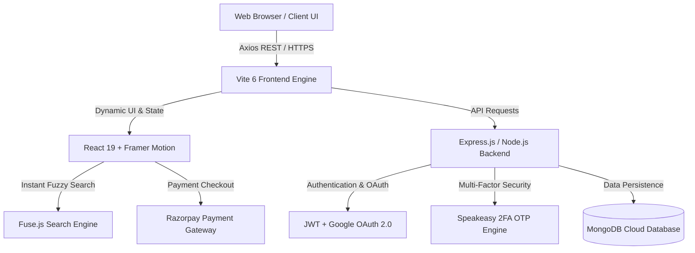

<div align="center">
  
  <h1>💍 ArtisanAlloy</h1>
  <h3>Where Elegance Meets Perfection</h3>
  <p><b>An Ultra-Luxury, High-Performance Handcrafted Jewelry E-Commerce Platform Built with React, TypeScript, Framer Motion, and Node.js</b></p>

  <p>
    
    
    
    
    
    
    
    
  </p>
  
  <div style="margin-top: 20px;">
    <a href="https://github.com/PrashantCodes150">
      
    </a>
  </div>
</div>

---

## 🌟 Executive Summary & Vision

**ArtisanAlloy** is a state-of-the-art web application engineered to redefine digital jewelry retailing. Combining curated visual aesthetics (dark mode glassmorphism, golden typography, and micro-animations) with robust full-stack engineering, ArtisanAlloy delivers an immersive shopping experience. From kundan bridal sets to minimalist contemporary diamonds, every touchpoint is crafted for high performance, accessibility, and security.

<div align="center">
  
  <p><i>The obsidian dark-mode hero section featuring tailored HSL gold typography and smooth glassmorphism.</i></p>
</div>

---

## 💎 Core Functional Modules & UI Experience

### 🛍️ 1. Curated Catalog & Live Multi-Dimensional Filtering
Customers can effortlessly explore jewelry collections filtered by metal purity (18K, 22K, 24K Gold, Platinum, Sterling Silver), gemstone varieties, and price brackets. Powered by **Fuse.js**, our typo-tolerant real-time search engine instantly locates specific pieces even with misspelled queries.

<div align="center">
  
  <p><i>Interactive product cards showing percentage discounts, wishlist toggles, and high-definition jewelry imagery.</i></p>
</div>

---

### 🎓 2. Educational "Learn" Ecosystem & Navigation
ArtisanAlloy elevates standard e-commerce into a private luxury salon by providing educational resources. Through our dedicated **Learn** menu, buyers can check daily live metal rates, discover astrological Rashi and Birthstone jewelry, and read historical deep dives into jewelry artistry.

<div align="center">
  
  <p><i>Seamless glassmorphic dropdown navigation providing instant access to jewelry types, metal rates, and gemstone guides.</i></p>
</div>

---

### 🌟 3. Dynamic Promotional Banners & Exclusive Collections
To engage high-net-worth buyers, the platform features auto-scrolling promotional banners highlighting seasonal collections, such as Ruby & Sapphire gemstone specials, tailored for formal luxury events.

<div align="center">
  
  <p><i>High-impact promotional showcases engineered with Framer Motion gesture sliders.</i></p>
</div>

---

## 🥧 Engineering & Architecture Breakdown

To provide recruiters and architects with clear visibility into the system design, the charts below illustrate the technical effort distribution and system flow.

### 📊 Development Effort Distribution


### 💻 Codebase Language Composition


### 🏗️ Full-Stack System Architecture


---

## ✨ Key Features & Technical Highlights

* 💎 **Visual Excellence & Glassmorphism:** Curated HSL color palettes, custom Google Fonts typography (*Outfit* & *Playfair Display*), and subtle neon-gold glow accents create an unforgettable first impression.
* ⚡ **Blazing Fast Performance:** Built on Vite 6 with optimized dependency pre-bundling, lazy-loading, and responsive asset sizing for near-instant page transitions.
* 🔍 **Intelligent Search & Filtering:** Powered by **Fuse.js**, allowing users to perform lightning-fast fuzzy searches across metal types (18K, 22K, 24K), gemstones, categories, and price brackets.
* 🔐 **Enterprise-Grade Security Suite:**
  * **JWT Authentication:** Secure token-based access with refresh mechanisms.
  * **Two-Factor Authentication (2FA):** Integrated **Speakeasy** OTP verification with scannable QR codes and backup recovery codes.
  * **OAuth 2.0:** Seamless 1-click social login via Google.
* 💳 **Seamless Razorpay Checkout:** Fully integrated payment gateway supporting UPI, Credit/Debit Cards, Net Banking, and Cash on Delivery (COD) with automated error handling and payment retries.
* 📱 **100% Adaptive Responsive Design:** Flawless layout adaptation across smartphones, tablets, and wide-screen desktop displays using CSS Grid and Flexbox architecture.

---

## 📂 Project Structure

```text
Artisan-Alloy-react/
├── 📁 api/                   # Backend Express.js & MongoDB Server
│   ├── 📁 src/
│   │   ├── 📁 config/        # Database & OAuth Configurations
│   │   ├── 📁 controllers/   # Route Controllers (Auth, Orders, Products)
│   │   ├── 📁 models/        # Mongoose Data Models
│   │   └── 📁 routes/        # REST API Endpoints
│   └── server.ts             # Backend Entry Point
├── 📁 public/                # Static Assets & Brand Emblems
│   ├── 📁 screenshots/       # UI Showcase Images for README
│   └── favicon.svg           # ArtisanAlloy Brand Emblem
├── 📁 src/                   # Frontend React + TypeScript Application
│   ├── 📁 assets/            # Luxury Product Images & Models
│   ├── 📁 components/        # Reusable UI Components (Navbar, Banners, Cards)
│   ├── 📁 context/           # React Context (Auth, Cart, Theme)
│   ├── 📁 data/              # Static Catalog & Jewelry Type Data
│   ├── 📁 pages/             # Main Route Pages (Home, Collection, Checkout, 2FA)
│   ├── 📁 services/          # Axios API Services & Razorpay Integration
│   └── App.tsx               # Application Root & Routing
├── package.json              # Project Dependencies & Scripts
├── tailwind.config.js        # Design System & Color Tokens
├── tsconfig.json             # TypeScript Compiler Options
└── vite.config.ts            # Vite Bundler Configuration
```

---

## 🚀 Quick Start Guide

### 1. Clone the Repository
```bash
git clone https://github.com/PrashantCodes150/f-jewelry-react.git
cd f-jewelry-react-master
```

### 2. Install Dependencies
```bash
# Install frontend dependencies
npm install

# Install backend dependencies (optional, for local API server)
cd api
npm install
cd ..
```

### 3. Environment Setup
Create a `.env` file in the root directory:
```env
VITE_API_URL=https://your-backend-url.onrender.com/api/v1
VITE_APP_NAME=ArtisanAlloy
VITE_RAZORPAY_KEY_ID=your_razorpay_test_key_id
```

### 4. Run Development Server
```bash
# Launch the frontend dev server at http://localhost:5173
npm run dev
```

---

## 🛡️ License & Acknowledgments

This project is developed and maintained by **PrashantCodes150**. Dedicated to demonstrating world-class modern web development, UI/UX aesthetics, and full-stack engineering excellence.

<div align="center">
  <p><b>Crafted with ❤️ and Precision for ArtisanAlloy</b></p>
</div>
<!-- tier trigger 1 -->
<!-- tier trigger 2 -->
<!-- tier trigger 3 -->
<!-- tier trigger 4 -->
<!-- tier trigger 5 -->
<!-- tier trigger 6 -->
<!-- tier trigger 7 -->
<!-- tier trigger 8 -->
<!-- tier trigger 9 -->
<!-- tier trigger 10 -->
<!-- tier trigger 11 -->
<!-- tier trigger 12 -->
<!-- tier trigger 13 -->
<!-- tier trigger 14 -->
<!-- tier trigger 15 -->
<!-- tier trigger 16 -->
<!-- tier trigger 17 -->
<!-- tier trigger 18 -->
<!-- tier trigger 19 -->
<!-- tier trigger 20 -->
<!-- tier trigger 21 -->
<!-- tier trigger 22 -->
<!-- tier trigger 23 -->
<!-- tier trigger 24 -->
<!-- tier trigger 25 -->
<!-- tier trigger 26 -->
<!-- tier trigger 27 -->
<!-- tier trigger 28 -->
<!-- tier trigger 29 -->
<!-- tier trigger 30 -->
<!-- tier trigger 31 -->
<!-- tier trigger 32 -->
<!-- tier trigger 33 -->
<!-- tier trigger 34 -->
<!-- tier trigger 35 -->
<!-- tier trigger 36 -->
<!-- tier trigger 37 -->
<!-- tier trigger 38 -->
<!-- tier trigger 39 -->
<!-- tier trigger 40 -->
<!-- tier trigger 41 -->
<!-- tier trigger 42 -->
<!-- tier trigger 43 -->
